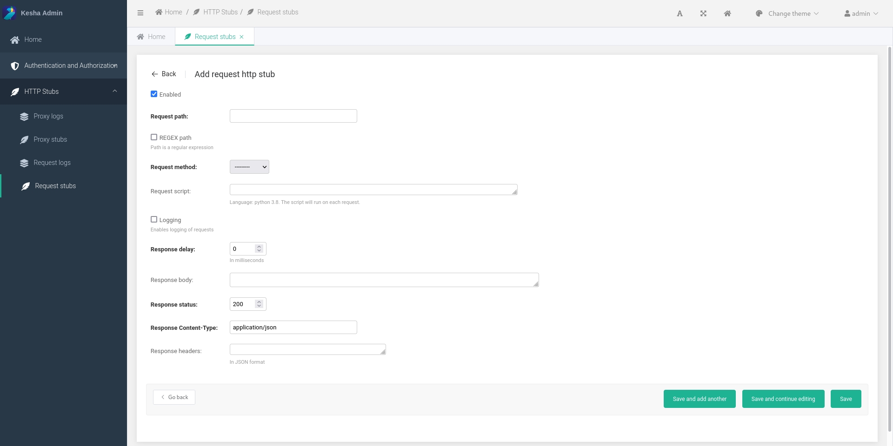
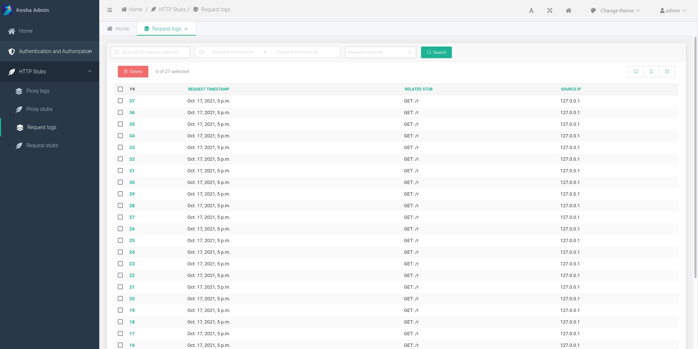

# First steps

## Create an http-stub

1. Go to `HTTP Stubs` -> `Request stubs`
    
1. Click the `Add` button
1. Fill in the required fields
    
1. Click the `Save` button

## Logs

1. Send a http-request to the created http-stub
1. Go to `HTTP Stubs` -> `Request logs`
    
1. Watch incoming requests :) 
