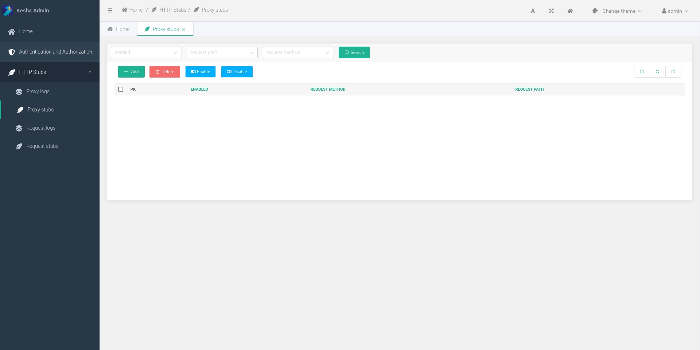
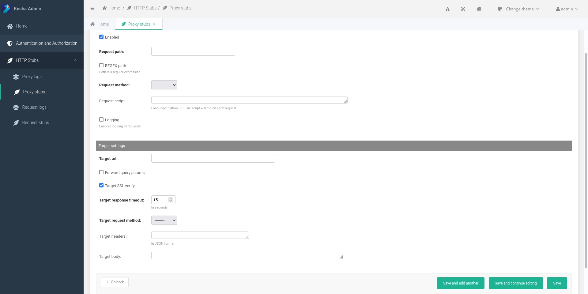

# Proxy stubs

## Create a proxy http stub

1. Go to `HTTP Stubs` -> `Proxy stubs`
    
1. Click the `Add` button
1. Fill in the required fields
    
1. Click the `Save` button

## Logs

1. Send a http-request to the created http-stub
1. Go to `HTTP Stubs` -> `Proxy logs`
    
1. Watch incoming requests :) 
