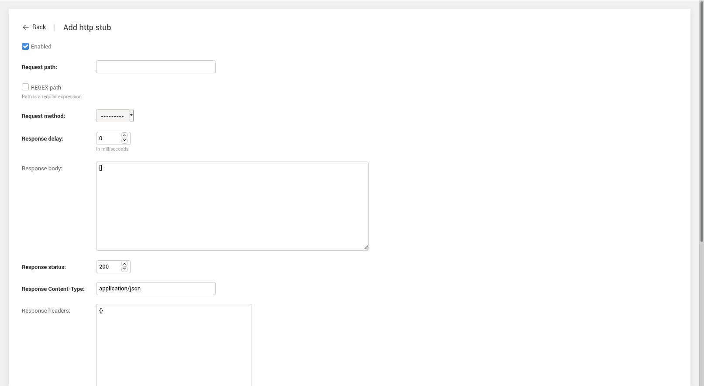
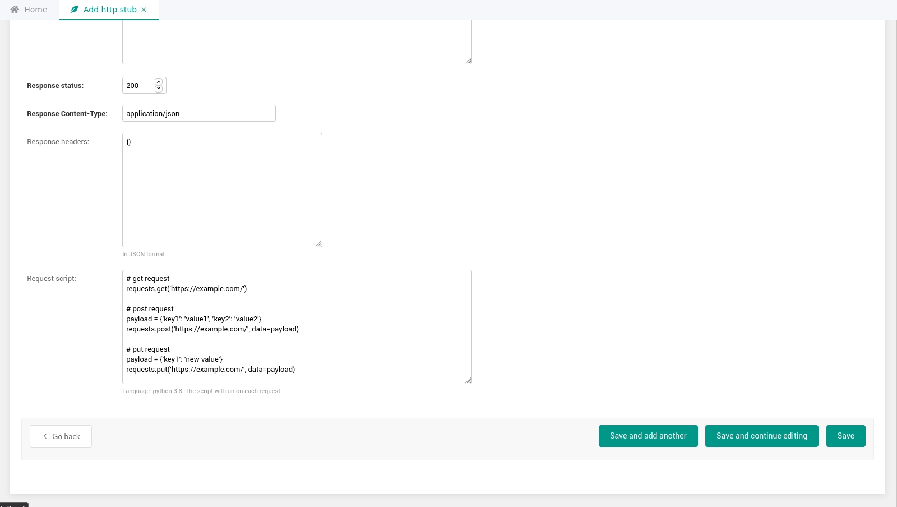

# Use request scripts

## For using it
1. Create an http stub ([first steps](first-steps.html))
    
1. In the "request script" field, add a Python script
    

## About scripts
Request scripts support a secure subset of Python version 3.8.  
Additionally, [json](https://docs.python.org/3/library/json.html) and [requests](https://requests.readthedocs.io/en/master/) modules are available to the script.  
As well as a special variable that stores the request body `request_body`.  

## Examples
### Calling external services
```python
# get request
requests.get('https://example.com/')

# post request
payload = {'key1': 'value1', 'key2': 'value2'}
requests.post('https://example.com/', data=payload)

# put request
payload = {'key1': 'new value'}
requests.put('https://example.com/', data=payload)
```
For more examples, see the official documentation [https://requests.readthedocs.io/en/master/](https://requests.readthedocs.io/en/master/).

### Parsing the request body in json format
For example, use the preset variable `request_body`.  
`request_body` is a variable containing a body of the request received by Parrot.
```python
parsed_data = json.loads(request_body)
requests.post(
    'https://example.com/',
    data={'user': parsed_data['request_user']}
)
```
