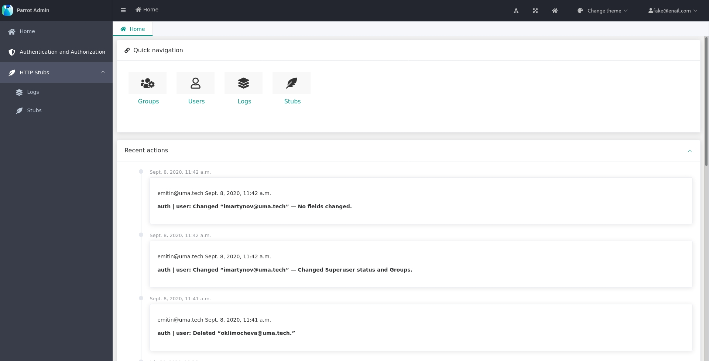
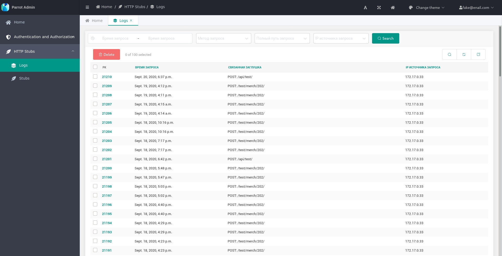
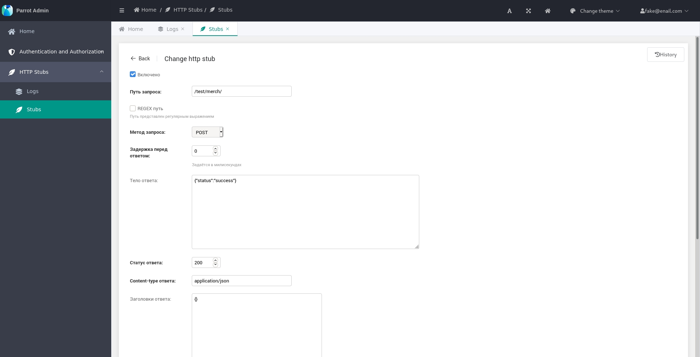

# Parrot
_Web-service for testing http requests and webhooks._
  

     
     
    
     

## Links:
1. Repository: [https://github.com/Uma-Tech/parrot](https://github.com/Uma-Tech/parrot)
1. Documentation: `TDB`
1. Docker Hub: [https://registry.hub.docker.com/r/umahighload/parrot-app](https://registry.hub.docker.com/r/umahighload/parrot-app)
1. Issue tracker: [https://github.com/Uma-Tech/parrot/issues](https://github.com/Uma-Tech/parrot/issues)
1. Changelog: [https://github.com/Uma-Tech/parrot/blob/develop/CHANGELOG.md](https://github.com/Uma-Tech/parrot/blob/develop/CHANGELOG.md)

## Components
1. Database postgres.
1. Python-app based on Django Web Framework.

## Screenshots

  

  

  

